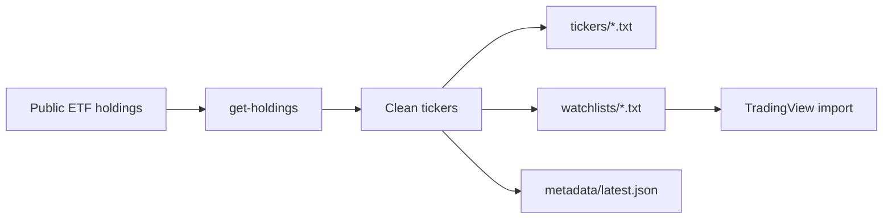

# 📈 Index ETF Ticker Symbols

<p align="center">
  <strong>Fresh ticker lists for major US indexes — ready for TradingView, scripts, and quick market scans.</strong>
</p>

<p align="center">
  <a href="https://github.com/major/index-etfs/actions/workflows/ci.yml"></a>
  <a href="https://github.com/major/index-etfs/actions/workflows/main.yml"></a>
  <a href="https://codecov.io/gh/major/index-etfs"></a>
  
  
</p>

> ⚠️ Not financial advice. Just a tiny robot that turns public ETF holdings into useful ticker files.

## ✨ What you get

| 🧰 Output | 📍 Location | ✅ Best for |
|---|---|---|
| TradingView watchlists | [`watchlists/`](watchlists/) | Importing `EXCHANGE:TICKER` symbols directly into TradingView |
| Plain ticker lists | [`tickers/`](tickers/) | Scripts, spreadsheets, scanners, and quick diffs |
| Refresh metadata | [`metadata/latest.json`](metadata/latest.json) | Generated time, counts, thresholds, and source URLs |
| Daily refreshes | [GitHub Actions](https://github.com/major/index-etfs/actions/workflows/main.yml) | Keeping index membership changes visible over time |



## 🚀 Download files

Grab the TradingView version for watchlist imports, or the plain ticker file for scripts and spreadsheets.

| Index | ETF | TradingView watchlist | Plain tickers | Approx. count |
|---|---|---|---|---:|
| S&P 500 | SPY | [💾 sp500.txt](https://raw.githubusercontent.com/major/index-etfs/main/watchlists/sp500.txt) | [💾 spy.txt](tickers/spy.txt) | ~503 |
| Nasdaq-100 | QQQ | [💾 nasdaq100.txt](https://raw.githubusercontent.com/major/index-etfs/main/watchlists/nasdaq100.txt) | [💾 qqq.txt](tickers/qqq.txt) | ~101 |
| S&P MidCap 400 | MDY | [💾 sp400.txt](https://raw.githubusercontent.com/major/index-etfs/main/watchlists/sp400.txt) | [💾 mdy.txt](tickers/mdy.txt) | ~400 |
| S&P SmallCap 600 | SPSM | [💾 sp600.txt](https://raw.githubusercontent.com/major/index-etfs/main/watchlists/sp600.txt) | [💾 spsm.txt](tickers/spsm.txt) | ~605 |
| Russell 2000 | IWM | [💾 russell2000.txt](https://raw.githubusercontent.com/major/index-etfs/main/watchlists/russell2000.txt) | [💾 iwm.txt](tickers/iwm.txt) | ~1906 |

TradingView files contain `EXCHANGE:TICKER` symbols. Plain files contain bare tickers. Both are sorted alphabetically by ticker.

## 🛠️ Run it locally

```bash
uv sync
uv run get-holdings
```

That rewrites `tickers/*.txt` and `watchlists/*.txt` from the latest available holdings data.

## 🔎 Track changes

Want to see index additions and removals? Check the [main branch commits](https://github.com/major/index-etfs/commits/main/) after each refresh.
